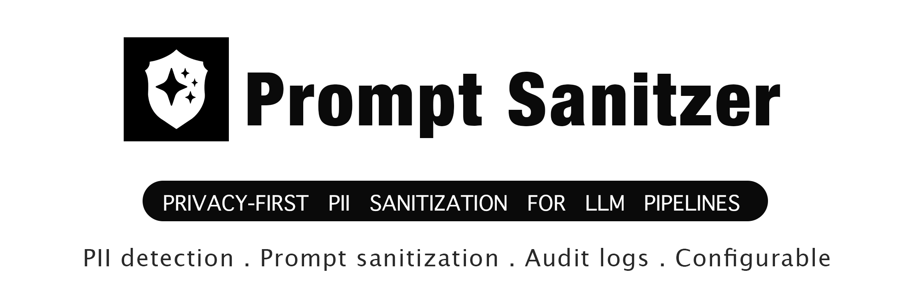

<p align="center">
  
</p>

# prompt sanitizer

[](packages/python/)
[](packages/javascript/)
[](packages/ruby/)
[](#license)
[](#quality--benchmarks)

Privacy-first PII sanitization for LLM pipelines — **Python, TypeScript/JavaScript, and Ruby from one monorepo**.

`prompt sanitizer` runs **entirely in-process**: no cloud calls, no telemetry, no outbound dependency on third-party redaction APIs. In FAST mode it stays lean with **zero ML dependencies**. In SMART and FULL modes it adds **fully local NER** for names and organizations via Piiranha mDeBERTa-v3 on Python and Xenova BERT-NER-style models on JavaScript, plus bidirectional deanonymization, synthetic replacements, and audit logging. The Ruby gem brings the same pipeline to Rails and Rack applications with native integrations and zero required runtime dependencies.

---

## Why teams pick prompt sanitizer

- 🛡️ **Local-only by design** — sanitize prompts before they leave your process
- ⚡ **Sub-millisecond FAST mode** — regex + secrets engine, zero ML deps
- 🧠 **Local NER in SMART/FULL** — Piiranha mDeBERTa-v3 (Python) / Xenova BERT-NER-style transformers (JS) / informers distilbert (Ruby)
- 🔁 **Bidirectional vault** — anonymize input, send placeholders to the LLM, restore originals in the response
- 🎭 **Synthetic replacements** — realistic fake names, emails, phones, addresses via Faker instead of blunt `[REDACTED]`
- 🔐 **Secrets coverage built in** — OpenAI, Anthropic, GitHub, AWS, JWT, DB URLs, private keys, and more
- 🧾 **Tamper-evident audit logging** — hashed event records with in-memory and SQLite backends
- 🔌 **Framework integrations** — OpenAI SDK, LangChain, LlamaIndex, FastAPI, Django, Vercel AI SDK, Express, Next.js, Rails/Rack, ActionController, ActiveJob
- 🔄 **Three runtimes** — same mental model and API shape in Python, TypeScript, and Ruby

---

## Modes

| Mode      | What runs                                 | Best for                                                               |
| --------- | ----------------------------------------- | ---------------------------------------------------------------------- |
| **FAST**  | Regex + secrets engine                    | High-throughput prompt filtering, edge workloads, low-latency services |
| **SMART** | FAST + local NER                          | User-generated input where names, orgs, and context PII matter         |
| **FULL**  | SMART + synthetic replacement + audit log | Production workflows, compliance, GDPR/HIPAA-sensitive systems         |

### What that means in practice

- **FAST** catches structured PII and secrets with no ML model load.
- **SMART** adds local entity recognition for people, organizations, and locations.
- **FULL** is the "ship it" mode: safer replacements, auditability, and reversible vault-based workflows.

---

## Benchmark snapshot

Source: [`benchmarks/RESULTS.md`](benchmarks/RESULTS.md)

| Tool                       | Regex F1 | Person recall | Latency (medium, FAST) | API key recall |
| -------------------------- | -------- | ------------- | ---------------------- | -------------- |
| **prompt sanitizer FAST**  | ~93%     | 0%            | **0.3 ms**             | **100%**       |
| **prompt sanitizer SMART** | ~93%     | **~88%**      | 3–4 ms                 | **100%**       |
| Presidio                   | ~82%     | ~80%          | 15 ms                  | 0%             |
| LLM Guard                  | ~82%     | ~85%          | 150–500 ms             | 0%             |
| OpenRedaction (JS)         | ~78%     | 0%            | 0.5 ms                 | 60%            |

### Key takeaways

- **FAST mode** is built for throughput: pure in-process detection, no model downloads, sub-ms median latency.
- **SMART mode** closes the NER gap without giving up local execution.
- **Secrets detection is not bolted on** — API keys and tokens are first-class detection targets, not an afterthought.
- **No competing tool in the benchmark combines** dual runtime + local NER + bidirectional vault + synthetic replacement + audit log.

> Benchmark numbers are warmup-excluded and environment-dependent. Re-run locally for your hardware and workload.

---

## Installation

### Python

```bash
pip install ai-prompt-sanitizer              # FAST mode — zero ML deps
pip install 'ai-prompt-sanitizer[nlp]'       # + local NER for SMART/FULL
pip install 'ai-prompt-sanitizer[synthetic]' # + realistic fake replacements
pip install 'ai-prompt-sanitizer[all]'       # everything
```

### JavaScript / TypeScript

```bash
npm install prompt-sanitizer

# optional: NER support for SMART/FULL
npm install @huggingface/transformers

# optional: synthetic replacement
npm install @faker-js/faker
```

### Ruby

```bash
# Gemfile
gem "prompt-sanitizer"
bundle install

# SMART / FULL mode — local NER (requires Ruby >= 3.3)
gem "informers"   # distilbert ONNX — recommended
# or
gem "mitie"       # MITIE-based NER — alternative

# FULL mode — realistic synthetic replacements
gem "faker"
```

### Runtime requirements

- **Python:** `>=3.10`
- **Node.js:** `>=18`
- **Ruby:** `>=3.1` (`>=3.3` for NER backends)

---

## Quick start — Python

```python
from prompt_sanitizer import Mode, Sanitizer, SQLiteAuditLog

# 1) One-shot sanitize
s = Sanitizer()  # Mode.FAST by default
result = s.sanitize("Hi, I'm Alice. Email me at alice@example.com")
print(result.text)      # redacted / replaced text
print(result.entities)  # list[DetectedEntity]
print(result.tokens)    # original -> placeholder mapping

# 2) Bidirectional session (anonymize -> LLM -> deanonymize)
session = s.session()
clean = session.anonymize("Call Alice at (415) 867-5309")
reply = call_llm(clean)             # model sees placeholders, not raw PII
final = session.deanonymize(reply)  # restore originals in the model output

# 3) Guard a call site
@s.guard(on_detect="redact")
def call_openai(prompt: str) -> str:
    return prompt

# 4) SMART mode with local NER
smart = Sanitizer(mode=Mode.SMART)
result = smart.sanitize("My name is Dr. John Smith")
print([(e.entity_type, e.value) for e in result.entities])

# 5) FULL mode with persistent audit log
audit = SQLiteAuditLog("./prompt-sanitizer-audit.db")
full = Sanitizer(mode=Mode.FULL, audit_log=audit)
full.sanitize("Contact alice@example.com about claim 123-45-6789")
print(audit.export(format="json", since="1d"))
```

### Common Python integrations

- **OpenAI SDK wrapper** — sanitize `messages` before send, deanonymize responses after receive
- **LangChain** — runnable + LLM wrappers
- **LlamaIndex** — node/postprocessor integration
- **FastAPI / Starlette** — request middleware for chat endpoints
- **Django** — middleware for inbound/outbound application flows

Example import paths:

```python
from prompt_sanitizer.integrations.openai import wrap
from prompt_sanitizer.integrations.langchain import PromptSanitizerRunnable, SanitizedLLM
from prompt_sanitizer.integrations.fastapi import SanitizerMiddleware
from prompt_sanitizer.integrations.django import SanitizerMiddleware
from prompt_sanitizer.integrations.llamaindex import PromptSanitizerPostprocessor
```

---

## Quick start — JavaScript / TypeScript

```ts
import { Mode, Sanitizer, AuditLog } from "prompt-sanitizer";

// 1) One-shot sanitize
const s = new Sanitizer();
const result = await s.sanitize("Hi, I'm Alice. Email alice@example.com");
console.log(result.text); // redacted / replaced text
console.log(result.entities); // DetectedEntity[]
console.log(result.tokens); // original -> placeholder mapping

// 2) Bidirectional session
const session = s.session();
const clean = await session.anonymize("Call Alice at (415) 867-5309");
const reply = await callLLM(clean);
const final = session.deanonymize(reply);

// 3) Guard a function
const safeCall = s.guard(async (prompt: string) => {
  return prompt;
});

// 4) SMART mode with local NER
const smart = new Sanitizer({ mode: Mode.SMART });
const smartResult = await smart.sanitize("My name is Dr. John Smith");
console.log(smartResult.entities);

// 5) FULL mode with audit log
const audit = new AuditLog();
const full = new Sanitizer({ mode: Mode.FULL, auditLog: audit });
await full.sanitize("Email alice@example.com and JWT eyJhbGciOi...");
console.log(audit.events());
```

### Common JS/TS integrations

- **Vercel AI SDK** — wrap `generateText` and `streamText`
- **Express / Hono** — sanitize request bodies, restore placeholders in responses
- **Next.js** — middleware helpers for server-side flows
- **LangChain.js** — sanitized wrappers for LLMs and chains
- **LlamaIndex.TS** — post-process nodes before they hit your model stack

Example import paths:

```ts
import {
  createExpressMiddleware,
  createHonoMiddleware,
} from "prompt-sanitizer/integrations/express";
import { createNextjsMiddleware } from "prompt-sanitizer/integrations/nextjs";
import {
  wrapGenerate,
  wrapStream,
} from "prompt-sanitizer/integrations/vercel-ai";
import { SanitizedLLM } from "prompt-sanitizer/integrations/langchain";
import { PromptSanitizerNodePostprocessor } from "prompt-sanitizer/integrations/llamaindex";
```

### Express example

```ts
import express from "express";
import { Sanitizer, Mode } from "prompt-sanitizer";
import { createExpressMiddleware } from "prompt-sanitizer/integrations/express";

const app = express();
app.use(express.json());
app.use(createExpressMiddleware(new Sanitizer({ mode: Mode.SMART })));
```

### Vercel AI SDK example

```ts
import { generateText, streamText } from "ai";
import { openai } from "@ai-sdk/openai";
import { Sanitizer } from "prompt-sanitizer";
import {
  wrapGenerate,
  wrapStream,
} from "prompt-sanitizer/integrations/vercel-ai";

const sanitizer = new Sanitizer();
const safeGenerateText = wrapGenerate(sanitizer, generateText);
const safeStreamText = wrapStream(sanitizer, streamText);

const { text } = await safeGenerateText({
  model: openai("gpt-4o"),
  prompt: "My email is alice@example.com. Summarize this request.",
});

const result = await safeStreamText({
  model: openai("gpt-4o"),
  prompt: "Call Alice at 415-867-5309 tomorrow.",
});
```

---

## Quick start — Ruby

```ruby
require "prompt_sanitizer"

# 1) One-shot sanitize
s = PromptSanitizer::Sanitizer.new   # :fast mode by default
result = s.sanitize("Hi, I'm Alice. Email me at alice@example.com")
puts result.text      # "Hi, I'm Alice. Email me at [EMAIL_1]"
puts result.entities  # [#<DetectedEntity entity_type=:email ...>]
puts result.any?      # true

# 2) Bidirectional session (anonymize → LLM → deanonymize)
session = s.session
clean   = session.anonymize("Call Alice at (415) 867-5309")
reply   = call_llm(clean)             # model sees [PHONE_1], not the real number
final   = session.deanonymize(reply)  # originals restored

# Block form — vault cleared automatically
s.session do |sess|
  clean = sess.anonymize(user_prompt)
  sess.deanonymize(llm_client.chat(clean))
end

# 3) SMART mode with NER (requires `gem "informers"`)
smart  = PromptSanitizer::Sanitizer.new(mode: :smart)
result = smart.sanitize("My name is Dr. John Smith")
puts result.entities.map { |e| [e.entity_type, e.original] }

# 4) FULL mode with audit log + realistic fake replacements
audit = PromptSanitizer::Audit::MemoryAuditLog.new
full  = PromptSanitizer::Sanitizer.new(mode: :full, audit_log: audit)
full.sanitize("Contact alice@example.com about claim 234-56-7890")
puts audit.export(format: :json, since: "1h")

# 5) Block on PII
strict = PromptSanitizer::Sanitizer.new(on_detect: :block)
begin
  strict.sanitize("My SSN is 234-56-7890")
rescue PromptSanitizer::PIIDetectedError => e
  puts e.entities.first.entity_type   # => :ssn
end
```

### Rails quick start

```bash
rails generate prompt_sanitizer:install
# → creates config/initializers/prompt_sanitizer.rb
```

```ruby
# config/initializers/prompt_sanitizer.rb
PromptSanitizer.configure do |config|
  config.mode           = :smart
  config.ner_backend    = :informers   # or :mitie
  config.on_detect      = :redact
  config.use_middleware = true         # sanitize JSON bodies automatically
  config.audit_log      = :memory
end
```

```ruby
# ActionController concern
class ChatController < ApplicationController
  include PromptSanitizer::Integrations::ActionControllerConcern

  def create
    with_pii_session do |session|
      clean  = session.anonymize(params[:prompt])
      @reply = session.deanonymize(LLMClient.chat(clean))
    end
  end
end
```

```ruby
# ActiveJob concern
class LLMJob < ApplicationJob
  include PromptSanitizer::Integrations::ActiveJobConcern
  sanitize_argument :prompt   # stripped before perform

  def perform(prompt:)
    LLMClient.chat(prompt)
  end
end
```

### Common Ruby / Rails integrations

- **Rack middleware** — sanitizes `prompt`, `messages[].content`, `text`, `query` in JSON bodies
- **ActionController** — `sanitize_params!(*keys)` and `with_pii_session { }` helpers
- **ActiveJob** — `sanitize_argument :field` macro with `around_perform` callback
- **Custom patterns** — add employee IDs, claim numbers, or tenant keys via `add_pattern`

---

````

---

## How the bidirectional vault works

The core workflow is simple:

1. **Detect** PII and secrets in the prompt
2. **Replace** values with placeholders or realistic synthetic values
3. **Store** the mapping in a session vault
4. **Send** only sanitized text to the model
5. **Restore** originals in the model output when needed

That gives you a cleaner trust boundary:

- your LLM provider never sees the original secret or identifier
- your app keeps the context needed to restore useful output
- multi-turn flows can preserve consistent replacements across a session

Example:

```text
Input:        "Email Alice at alice@example.com"
Anonymized:   "Email [PERSON_1] at [EMAIL_1]"
LLM output:   "I've drafted a reply to [PERSON_1] at [EMAIL_1]"
Deanonymized: "I've drafted a reply to Alice at alice@example.com"
````

### Surviving process restarts (persisted sessions)

By default a session's vault lives only in process memory — fine for a
single long-running process, but gone on a worker restart, redeploy, or
serverless cold start. Pass a `VaultStore` to reattach to the same mapping
later by `sessionId`/`session_id`:

```ts
// TypeScript
import { FileVaultStore } from "prompt-sanitizer";

const store = new FileVaultStore("./vault-data");
const session = await sanitizer.session("user-42", { store });
const clean = await session.anonymize(userPrompt);
await session.persist();

// ...later, possibly in a new process:
const resumed = await sanitizer.session("user-42", { store });
const final = resumed.deanonymize(llmReply);
```

```python
# Python
from prompt_sanitizer import SQLiteVaultStore

store = SQLiteVaultStore("./vault.db")
session = sanitizer.session(session_id="user-42", store=store)
clean = session.anonymize(user_prompt)
session.persist()

# ...later, possibly in a new process:
resumed = sanitizer.session(session_id="user-42", store=store)
final = resumed.deanonymize(llm_reply)
```

```ruby
# Ruby
store = PromptSanitizer::VaultStore::FileVaultStore.new("./vault-data")
session = sanitizer.session(session_id: "user-42", store: store)
clean = session.anonymize(user_prompt)
session.persist

# ...later, possibly in a new process:
resumed = sanitizer.session(session_id: "user-42", store: store)
final = resumed.deanonymize(llm_reply)
```

No store is active unless you pass one — this is opt-in and changes
nothing for existing callers. Each vault owns its own placeholder counters
(the "1" in `[PERSON_1]`), so a reattached session can never reuse a token
that already means something else, even after a restart. The bundled
stores (`InMemoryVaultStore`/`FileVaultStore` in JS, `MemoryVaultStore`/
`SQLiteVaultStore` in Python, `MemoryVaultStore`/`FileVaultStore` in Ruby)
write the *actual original values* — treat the underlying file/db with the
same sensitivity as the source PII. For multi-server production
deployments, implement the store interface (`load`/`save`/`delete`,
three methods) against infrastructure you already run, e.g. Redis or
Postgres.

---

## Supported PII types

The project intentionally covers both **structured identifiers** and **secrets** that should never reach an LLM. The table below uses the project-level docs names, with notes where current Python/JS/Ruby enum names differ slightly in `v0.1.0`.

| Docs name           | Python runtime                      | JS runtime                 | Ruby runtime                          | Notes                                   |
| ------------------- | ----------------------------------- | -------------------------- | ------------------------------------- | --------------------------------------- |
| `EMAIL`             | `EMAIL`                             | `EMAIL`                    | `:email`                              | Email addresses                         |
| `PHONE`             | `PHONE`                             | `PHONE`                    | `:phone`                              | Local + international patterns          |
| `SSN`               | `SSN`                               | `SSN`                      | `:ssn`                                | US SSN formats                          |
| `CREDIT_CARD`       | `CREDIT_CARD`                       | `CREDIT_CARD`              | `:credit_card`                        | Major card formats with validation      |
| `IBAN`              | `IBAN`                              | `IBAN`                     | `:iban`                               | International bank account numbers      |
| `IP_ADDRESS`        | `IP_ADDRESS`                        | `IP_ADDRESS`               | `:ip_address`                         | IPv4 + IPv6                             |
| `URL`               | `URL`                               | `URL`                      | `:url`                                | URLs and common link patterns           |
| `API_KEY`           | `API_KEY`                           | `API_KEY`                  | `:api_key`                            | Generic and provider-specific API keys  |
| `JWT_TOKEN` / `JWT` | `JWT`                               | `JWT_TOKEN`                | `:jwt`                                | JSON Web Tokens                         |
| `PERSON_NAME`       | `PERSON`                            | `PERSON_NAME`              | `:person` (NER)                       | NER-backed in SMART/FULL                |
| `ORGANIZATION`      | via NER                             | `ORGANIZATION`             | `:organization` (NER)                 | NER-backed in SMART/FULL                |
| `LOCATION`          | via NER / address classes           | `LOCATION`                 | `:location` (NER)                     | NER-backed in SMART/FULL                |
| `DATE`              | `DATE`                              | date-like entities         | `:date`                               | Temporal values                         |
| `CUSTOM`            | `CUSTOM`                            | `CUSTOM`                   | `:custom`                             | User-defined regex/entity hooks         |
| `SECRET_KEY`        | generic secret assignments          | `SECRET_KEY`               | `:api_key` (generic pattern)          | `.env`-style secrets, config values     |
| `AWS_KEY`           | `AWS_ACCESS_KEY` / `AWS_SECRET_KEY` | `AWS_KEY`                  | `:aws_access_key` / `:aws_secret_key` | Access key IDs and secret keys          |
| `GITHUB_TOKEN`      | normalized under `API_KEY`          | `OAUTH_TOKEN`              | `:api_key` (normalized)               | `ghp_`, `github_pat_`, related families |
| `OPENAI_KEY`        | normalized under `API_KEY`          | normalized under `API_KEY` | `:api_key` (normalized)               | `sk-...` families                       |
| `ANTHROPIC_KEY`     | normalized under `API_KEY`          | normalized under `API_KEY` | `:api_key` (normalized)               | `sk-ant-...` families                   |

### Also covered in the current runtime implementations

Depending on runtime, the sanitizer also exposes or detects additional entity classes such as:

- **Python:** `ADDRESS`, `ZIP_CODE`, `DATE_OF_BIRTH`, `AGE`, `BANK_ACCOUNT`, `CRYPTO_ADDRESS`, `PASSPORT`, `DRIVING_LICENSE`, `MAC_ADDRESS`, `BEARER_TOKEN`, `PRIVATE_KEY`, `DB_CONNECTION`
- **JavaScript:** `MAC_ADDRESS`, `CRYPTO_ADDRESS`, `DATE_OF_BIRTH`, `PASSPORT`, `DRIVING_LICENSE`, `AGE`, `GENDER`, `NATIONALITY`, `RELIGION`, `PASSWORD`, `PRIVATE_KEY`, `DATABASE_URL`, `OAUTH_TOKEN`
- **Ruby:** `ZIP_CODE`, `DATE_OF_BIRTH`, `AGE`, `BANK_ACCOUNT`, `CRYPTO_ADDRESS`, `PASSPORT`, `DRIVING_LICENSE`, `MAC_ADDRESS`, `BEARER_TOKEN`, `PRIVATE_KEY`, `DB_CONNECTION`

If your workload has custom identifiers — employee IDs, claim numbers, ticket numbers, tenant keys — add them with custom patterns and keep them in the same sanitize/deanonymize pipeline.

---

## What makes this different from a basic redactor?

A lot of redaction libraries stop at “find a regex, replace with `[REDACTED]`”. That is useful, but incomplete for modern LLM systems.

`prompt sanitizer` is designed around real application flows:

- **Prompt safety** — sanitize before data leaves your process
- **Model utility** — preserve semantics with realistic synthetic replacements when needed
- **Response restoration** — deanonymize after inference so downstream UX stays natural
- **Operational visibility** — export hashed audit events without storing raw PII
- **Cross-runtime consistency** — keep the same patterns in Python backends and JS frontends/edge services

---

## Quality & benchmarks

This repo includes both correctness tests and reproducible benchmarks.

### Test status

- **Python:** `118 passed`
- **JavaScript / TypeScript:** `137 passed`
- **Ruby:** `188 passed`
- **Total:** `443 passed`

### Benchmark assets

- [`benchmarks/corpus/`](benchmarks/corpus/) — 47 labeled PII samples
- [`benchmarks/python/`](benchmarks/python/) — Python accuracy + latency runners
- [`benchmarks/javascript/`](benchmarks/javascript/) — JS accuracy + latency runners
- [`benchmarks/ruby/`](benchmarks/ruby/) — Ruby accuracy + latency runners
- [`benchmarks/RESULTS.md`](benchmarks/RESULTS.md) — published results

### Benchmark methodology highlights

- value-overlap matching instead of brittle exact-span scoring
- warmup excluded for steady-state latency
- regex-only tools expected to score `0%` on names without NER
- competitor tools benchmarked against the same corpus

Run them yourself:

```bash
# Python benchmarks
cd benchmarks/python
pip install -r requirements.txt
python run_accuracy.py
python run_latency.py

# JavaScript benchmarks
cd ../javascript
npm install
node run_accuracy.mjs
node run_latency.mjs

# Ruby benchmarks
cd ../ruby
bundle install
ruby run_accuracy.rb
ruby run_latency.rb
```

---

## Repository structure

```text
prompt-sanitizer/
├── packages/
│   ├── python/           # Python package (ai-prompt-sanitizer on PyPI)
│   ├── javascript/       # npm package (prompt-sanitizer on npm)
│   └── ruby/             # Ruby gem (prompt-sanitizer on RubyGems)
├── benchmarks/           # accuracy + latency benchmarks vs Presidio, LLM Guard, OpenRedaction
│   ├── corpus/           # 47 labeled PII samples
│   ├── python/
│   ├── javascript/
│   └── ruby/
└── docs/                 # additional docs
```

---

## When to use which mode

### Choose FAST if you need:

- maximum throughput
- zero ML dependencies
- secret/API key filtering on every request
- edge/serverless-friendly behavior

### Choose SMART if you need:

- person / org / location detection
- local NER without cloud APIs
- better coverage on free-form user input

### Choose FULL if you need:

- realistic fake replacements instead of placeholders
- audit export for review/compliance
- reversible multi-turn LLM sessions with safer defaults

---

## FAQ

### Why not just use Presidio?

Presidio is a strong project and a good fit for **Python-only** stacks that want a mature analyzer/anonymizer framework. The trade-offs are practical:

- it does **not** ship with the same built-in API key / secret coverage used here
- it does **not** provide the same bidirectional session vault workflow out of the box
- it is **Python-centric**, while prompt sanitizer ships matching JS/TS and Ruby runtimes
- its steady-state latency in the included benchmark is materially higher than FAST mode

If you already use Presidio for broader DLP workflows, prompt sanitizer can still complement it as a fast prompt-boundary sanitizer.

### Why not just use LLM Guard?

LLM Guard is useful when you want a broader LLM policy/security layer, especially in Python. But for prompt sanitization specifically:

- it is far slower in the benchmarked setup
- secrets/API keys are not a first-class strength in the published results here
- it does not focus on reversible vault-based anonymize/deanonymize sessions
- it is not designed around a dual-runtime Python + JS developer experience

Use LLM Guard when you need its guardrail surface area. Use prompt sanitizer when you need **fast, local, reversible PII sanitization**.

### Does the gem work without Rails?

Yes. The Ruby gem is Rack-compatible and works in any Ruby >= 3.1 environment. Rails integrations (Railtie, middleware, ActionController/ActiveJob concerns, install generator) auto-load only when Rails is present.

### Is FAST mode enough for production?

Often, yes — especially if your primary concern is structured PII and secrets. But FAST will not magically detect personal names in free text. If names, organizations, or locations matter, use **SMART** or **FULL**.

### Does FULL mode send anything to a third party?

No. FULL mode still runs locally. It adds local NER, synthetic replacement, and audit logging — not cloud processing.

### Does the audit log store raw PII?

No. The audit log stores **hashed event data**, not the original values. Python ships both `MemoryAuditLog` and `SQLiteAuditLog`; JS ships an in-memory `AuditLog`.

### Is this a full DLP or compliance platform?

No. It is a focused sanitizer for **LLM application boundaries**. You may still want upstream storage controls, retention policies, encryption, and provider-side data governance.

### Can I add my own entity types?

Yes. Both runtimes support custom patterns so internal identifiers can go through the same sanitize/deanonymize/audit pipeline.

---

## Design goals

- **Be fast in the default path**
- **Stay local and predictable**
- **Handle secrets as seriously as PII**
- **Preserve developer ergonomics**
- **Make Python, JavaScript, and Ruby feel like the same tool**

If that matches your stack, this repo is built for you.

---

## License

Prompt Sanitizer packages are released under MIT licence [MIT License](https://github.com/jeslor/prompt-sanitizer/blob/main/LICENSE).
